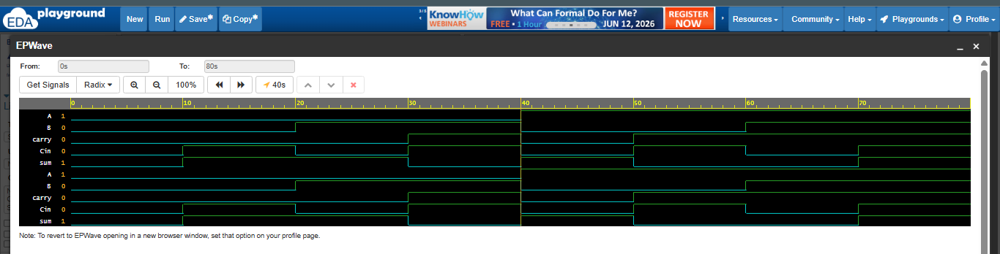

# Full Adder using Verilog

Back to basics, a verilog code for full adder

## Inputs
- A
- B
- Cin

## Outputs
- Sum
- Carry

## Logic
- Sum = A XOR B XOR Cin
- Carry = (A AND B) OR (B AND Cin) OR (A AND Cin)

## Tools Used
- EDA Playground
- Icarus Verilog
- EPWave

## Waveform

## Author
Jesna Mary Mathews
